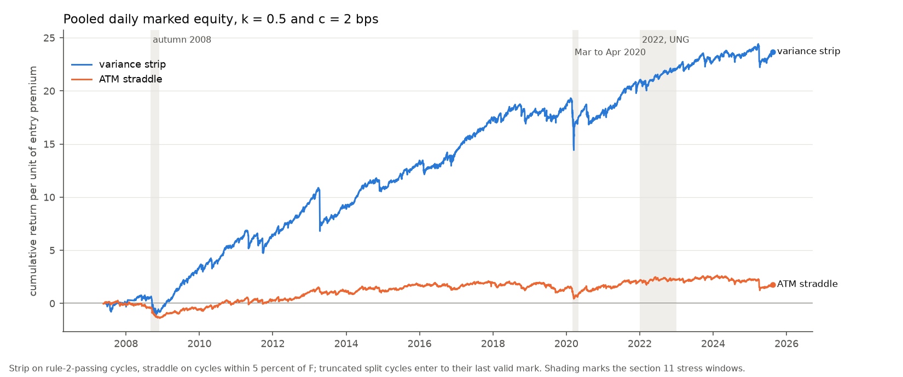
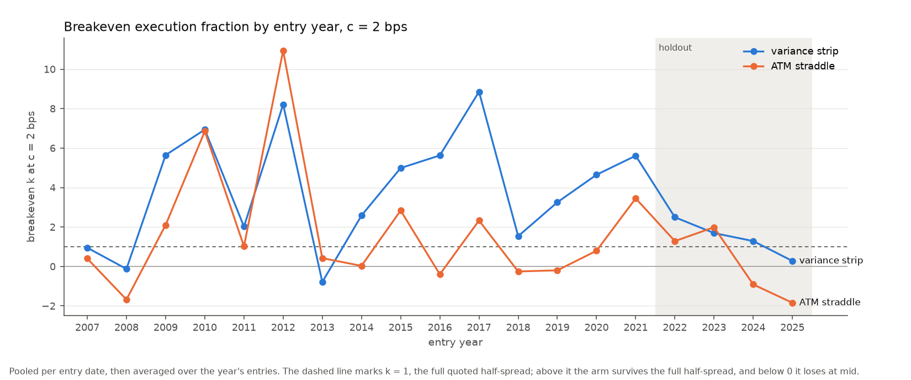

# Commodity variance risk premium and the futures curve

Do options on commodity ETFs price variance the way index options do, and does the premium depend on whether the futures curve is in contango or backwardation?

We studied options on GLD, SLV, USO and UNG from December 2008 to August 2025, with SPX as the equity benchmark. The implied variance measure is model-free, built from the full strike ladder on the CBOE VIX method; on SPX it tracks VIX at 0.999 correlation with a median absolute gap of 0.23 vol points. Realized variance is the sum of squared daily log returns over the following 21 or 63 trading days, annualized by 252 over the window length. The curve state for each commodity comes from individual futures settlements, nearest and second-nearest contract by last trading date.

Eighteen tests were registered, eight on the level of the premium and ten on its relation to the curve slope, with Holm correction inside each block. A result counts as supported only when Newey-West and a stationary block bootstrap both clear the corrected level.

## Results

Across the four commodity ETFs, 30-day implied variance ran 23 percent above the variance that followed, on average. The mean log ratio of implied to realized variance is 0.20 with a 95 percent interval of 0.16 to 0.24 on 4,165 trading days, using the at-the-money measure that covers every date. The gap rises to 43 percent on days where all four chains support the model-free construction, and every commodity carries the premium on its own at both maturities. SPX over the same window runs at 77 percent model-free against 43 percent for the commodities, so the commodity premium is a little over half the index premium in percentage terms and about 0.6 of it in log units.

The premium does not depend on the curve. None of the ten slope tests cleared the pre-set bar. The largest effect of a one-standard-deviation move in the curve slope is 0.08 log units. One cell, silver at 30 days, has intervals that exclude zero under both methods and still fails the Holm-corrected level on the bootstrap, which is the case the two-method rule exists to catch. The common factor across the four premia explains about 47 percent of their variance and moves by less than a point after conditioning on slope.

| node | ETF | series | n | mean log ratio | p Newey-West | p bootstrap | verdict |
|---|---|---|---|---|---|---|---|
| 30 | GLD | ATM | 4,170 | 0.1893 | 9.01e-11 | <0.0005 | supported |
| 30 | SLV | model-free | 3,143 | 0.3928 | 6.95e-30 | <0.0005 | supported |
| 30 | USO | ATM | 4,169 | 0.2225 | 3.29e-12 | <0.0005 | supported |
| 30 | UNG | ATM | 4,166 | 0.2097 | 6.76e-17 | <0.0005 | supported |
| 91 | GLD | ATM | 4,128 | 0.1946 | 0.0002 | 0.0005 | supported |
| 91 | SLV | model-free | 3,694 | 0.3509 | 7.31e-13 | <0.0005 | supported |
| 91 | USO | ATM | 4,127 | 0.1582 | 0.0043 | 0.0095 | supported |
| 91 | UNG | ATM | 4,124 | 0.1509 | 0.0004 | 0.0020 | supported |

| node | ETF | slope per 1 sd of z | Newey-West 95 percent interval | p Newey-West | p bootstrap | verdict |
|---|---|---|---|---|---|---|
| 30 | GLD | -0.0256 | [-0.0706, +0.0194] | 0.2651 | 0.2750 | not supported |
| 30 | SLV | -0.0739 | [-0.1241, -0.0237] | 0.0039 | 0.0120 | not robust to inference method |
| 30 | USO | -0.0055 | [-0.0528, +0.0419] | 0.8212 | 0.8370 | not supported |
| 30 | UNG | +0.0373 | [-0.0070, +0.0815] | 0.0989 | 0.0890 | not supported |
| 30 | POOLED | +0.0158 | [-0.0001, +0.0317] | 0.0509 | 0.1900 | not supported |
| 91 | GLD | -0.0576 | [-0.1281, +0.0128] | 0.1090 | 0.1160 | not supported |
| 91 | SLV | -0.0780 | [-0.1427, -0.0134] | 0.0180 | 0.0610 | not supported |
| 91 | USO | +0.0573 | [-0.0066, +0.1212] | 0.0790 | 0.0430 | not supported |
| 91 | UNG | +0.0335 | [-0.0198, +0.0867] | 0.2178 | 0.2260 | not supported |
| 91 | POOLED | +0.0248 | [+0.0021, +0.0475] | 0.0319 | 0.1040 | not supported |

| node | series | share before | share after | change |
|---|---|---|---|---|
| 30 | model-free | 0.4680 | 0.4691 | +0.0011 |
| 30 | ATM | 0.4783 | 0.4761 | -0.0022 |
| 91 | model-free | 0.5241 | 0.5186 | -0.0055 |
| 91 | ATM | 0.5635 | 0.5556 | -0.0079 |

For every commodity ETF except SLV, a registered check found that at one maturity or both the at-the-money premium on the dates the model-free construction drops differs at p below 0.05 from the premium on the dates it retains, so the at-the-money measure, which covers every date, carries their headline; the model-free numbers are larger in every case. Full construction rules, the test family and every judgment call are in items/item1_commodity_vrp/SPEC.md.

**What's not included:** The OptionMetrics feed used here ends 2025-08-29, so the sample closes in August 2025 and nothing is claimed about the period since. There isn't a trading strategy attached to the study, no cost model or hedging. The premium represents a measurement of how options are priced against what the underlying then does. Five changes made after the data pull and before any test, covering a data filter, the futures source and two registered diagnostics, are logged in section 13 of the spec. The design was written and committed before any result was computed. Options on the underlying futures contracts fall outside the OptionMetrics coverage used here, so what is measured is the premium on ETF options, and an extension to CME futures options would test the premium on the contracts the funds hold. The study prices variance on the ETFs themselves. GLD and SLV are bullion trusts whose shares track spot closely, while USO and UNG hold rolling futures and have carried roll drag and reverse splits, so their share variance diverges further from front-futures variance than the metals' does.

## Reproduce

Reproducing the study requires a WRDS account with OptionMetrics, Datastream futures and CBOE index access, and a ~/.pgpass entry.

    pip install -r requirements.txt
    python -m options_series.item1.run

The run pulls quotes for five underlyings and thirteen futures classes (four primary, nine screened for the gold and silver continuation), builds both implied variance measures, runs the tests and writes every figure and table under items/item1_commodity_vrp/output/.

## References

Carr, P. and Wu, L. (2009). Variance risk premiums. Review of Financial Studies 22(3), 1311–1341.
Jiang, G. and Tian, Y. (2005). The model-free implied volatility and its information content. Review of Financial Studies 18(4), 1305–1342.
Prokopczuk, M., Symeonidis, L. and Wese Simen, C. (2017). Variance risk in commodity markets. Journal of Banking and Finance 81, 136–149.
Trolle, A. and Schwartz, E. (2010). Variance risk premia in energy commodities. Journal of Derivatives 17(3), 15–32.
Jia, X., Ruan, X. and Zhang, J.E. (2023). Carr and Wu's (2020) framework in the oil ETF option market. Journal of Commodity Markets 31, 100334.
Ng, V. and Pirrong, S. (1994). Fundamentals and volatility: storage, spreads, and the dynamics of metals prices. Journal of Business 67(2), 203–230.
Politis, D. and Romano, J. (1994). The stationary bootstrap. Journal of the American Statistical Association 89(428), 1303–1313.

# Correlation risk premium: the index against its constituents

Is the variance premium on the S&P 500 index larger than the average variance premium on its constituents, and did the gap change between the post-crisis decade and the post-COVID years?

We studied the S&P 500 and its point-in-time constituents from January 1996 to August 2025, about 500 names a day, linked from CRSP to OptionMetrics by date range. Implied variance at 30 and 91 days is built model-free from the OptionMetrics volatility surface: the 34 delta nodes are interpolated linearly in strike, held flat beyond the 10-delta strikes and integrated on a 1,000-strike grid, following Jiang and Tian (2005). On SPX the construction tracks the strike-ladder measure of the commodity study at 0.994 correlation at 30 days and 0.991 at 91 days, with a median level 3 and 9 percent below it. Realized variance is the sum of squared daily log returns over the following 21 or 63 trading days, annualized by 252 over the window length. The gap is the index log(IV²/RV) minus its equal-weighted average across constituents, on days with at least 300 names carrying a valid surface; implied correlation follows Driessen, Maenhout and Vilkov (2009) with previous-day market-cap weights, on days with at least 450.

Six tests were registered, one per maturity for each of three hypotheses: the index premium exceeds the constituent average, the gap differs between 2021–2025 and 2010–2019, and implied correlation exceeds realized correlation, with Holm correction inside each pair. A result counts as supported only when Newey-West and a stationary block bootstrap both clear the corrected level.

## Results

On the registered measure the index premium exceeds the average constituent premium at 91 days and not at 30 days. The mean gap is 0.22 at 91 days with a 95 percent interval of 0.17 to 0.28 on 7,383 trading days, and −0.004 at 30 days with an interval of −0.043 to 0.034 on 7,425 days. The 30-day result depends on how implied variance is measured: the at-the-money measure gives a gap of 0.07 and value weights give 0.09, both with intervals clear of zero. Single-name surfaces at 30 days carry steep and steepening wings. The median ratio of surface to at-the-money variance for constituents rose from 1.14 in 1996–2007 to 1.57 in 2021–2025, while for SPX it stayed between 1.18 and 1.33, so the surface measure raises the single-name premium by more than the index premium; a strike-ladder construction on opprcd for all constituents is the measurement that would decide which implied measure the 30-day result rests on. In 2021–2025 an average of 76 percent of constituents had a higher annual 30-day premium than the index, against 28 percent in 1996–2007.

The gap fell after COVID. At 30 days it fell by 0.25 from 2010–2019 to 2021–2025, from −0.08 to −0.33, and clears both methods; at 91 days the fall of 0.15 does not. Outside the family, value weights give a 30-day fall of 0.17 on the surface measure and 0.10 at the money, both with p below 0.05, while the equal-weighted at-the-money fall of 0.10 has a Newey-West p of 0.07. Implied correlation exceeds realized correlation at both maturities, 0.36 against 0.31 at 30 days and 0.41 against 0.31 at 91 days. In the decomposition the correlation premium adds 0.10 log units to 30-day index variance in 2010–2019 and −0.04 in 2021–2025, and the residual, which holds correlation at its realized level, is negative in every period on the surface measure. The least-squares break in the annual gap falls in 2011 at 30 days and 2001 at 91 days. The share of SPX option volume expiring the same day rose from 1 percent in 2011 to 58 percent in 2025; neither the break nor that overlay carries a test.

| test | node | estimate | Newey-West 95 percent interval | p Newey-West | p bootstrap | verdict |
|---|---|---|---|---|---|---|
| H1 index minus average premium | 30 | -0.0043 | [-0.0429, +0.0343] | 0.5865 | 0.5785 | not supported |
| H1 index minus average premium | 91 | +0.2225 | [+0.1660, +0.2790] | 5.73e-15 | <0.0005 | supported |
| H2 2021–2025 minus 2010–2019 | 30 | -0.2526 | [-0.3624, -0.1429] | 6.39e-06 | <0.0005 | supported |
| H2 2021–2025 minus 2010–2019 | 91 | -0.1457 | [-0.3271, +0.0357] | 0.1155 | 0.1450 | not supported |
| H3 implied minus realized correlation | 30 | +0.0428 | [+0.0311, +0.0545] | 3.57e-13 | <0.0005 | supported |
| H3 implied minus realized correlation | 91 | +0.0976 | [+0.0786, +0.1165] | 3.05e-24 | <0.0005 | supported |

| node | measure | weights | H1 gap | p Newey-West | H2 change | p Newey-West |
|---|---|---|---|---|---|---|
| 30 | surface | equal, registered | -0.0043 | 0.5865 | -0.2526 | 6.39e-06 |
| 30 | surface | value | +0.0914 | 1.15e-07 | -0.1667 | 0.0006 |
| 30 | ATM | equal | +0.0681 | 3.30e-05 | -0.0960 | 0.0725 |
| 30 | ATM | value | +0.1040 | 5.59e-11 | -0.0969 | 0.0427 |
| 91 | surface | equal, registered | +0.2225 | 5.73e-15 | -0.1457 | 0.1155 |
| 91 | surface | value | +0.2467 | 2.58e-20 | -0.0849 | 0.2832 |
| 91 | ATM | equal | +0.1952 | 1.10e-13 | -0.1165 | 0.1675 |
| 91 | ATM | value | +0.2037 | 3.14e-16 | -0.1104 | 0.1355 |

| node | period | mean gap | correlation component | residual |
|---|---|---|---|---|
| 30 | 1996–2007 | 0.1744 | 0.3185 | -0.1441 |
| 30 | 2008–2009 | 0.0378 | 0.1075 | -0.0697 |
| 30 | 2010–2019 | -0.0784 | 0.0963 | -0.1747 |
| 30 | 2020 | -0.0051 | 0.1296 | -0.1347 |
| 30 | 2021–2025 | -0.3310 | -0.0376 | -0.2934 |
| 91 | 1996–2007 | 0.3301 | 0.4031 | -0.0731 |
| 91 | 2008–2009 | 0.0911 | 0.1296 | -0.0385 |
| 91 | 2010–2019 | 0.1953 | 0.2597 | -0.0644 |
| 91 | 2020 | 0.2279 | 0.2680 | -0.0400 |
| 91 | 2021–2025 | 0.0496 | 0.1904 | -0.1408 |

Every H1 and H2 number is also reported at the money and with value weights, and every table in the full results carries the SPX gap between the surface and strike-ladder measures, a median of −0.030 log units at 30 days and −0.095 at 91 days. Full construction rules, the test family and every judgment call are in items/item2_correlation_premium/SPEC.md.

**What's not included:** The OptionMetrics feed used here ends 2025-08-29, so the sample closes in August 2025 and nothing is claimed about the period since. There is no trading strategy attached to the study, no dispersion trade, cost model or hedging. The gap measures how index and single-name options are priced against what each then realizes.

## Reproduce

Reproducing the study requires a WRDS account with OptionMetrics, CRSP and the CRSP-OptionMetrics link, and a ~/.pgpass entry.

    pip install -r requirements.txt
    python -m options_series.item2.run

The run pulls the S&P 500 membership list, the link table, 30- and 91-day surfaces for every constituent from 1996 to 2025 (about 261 million rows; the run needs about 4 GB of disk), returns, CRSP prices and SPX option volume, builds both implied variance measures, runs the tests and writes every figure and table under items/item2_correlation_premium/output/. The SPX validation reads the strike-ladder series written by python -m options_series.item1.run, which runs first.

## References

Driessen, J., Maenhout, P. and Vilkov, G. (2009). The price of correlation risk: evidence from equity options. Journal of Finance 64(3), 1377–1406.
Carr, P. and Wu, L. (2009). Variance risk premiums. Review of Financial Studies 22(3), 1311–1341.
Jiang, G. and Tian, Y. (2005). The model-free implied volatility and its information content. Review of Financial Studies 18(4), 1305–1342.
Conrad, J., Dittmar, R. and Ghysels, E. (2013). Ex ante skewness and expected stock returns. Journal of Finance 68(1), 85–124.
Bai, J. and Perron, P. (1998). Estimating and testing linear models with multiple structural changes. Econometrica 66(1), 47–78.
Politis, D. and Romano, J. (1994). The stationary bootstrap. Journal of the American Statistical Association 89(428), 1303–1313.

# Short commodity variance: delta-hedged returns after measured costs

Does a seller of the variance premium the commodity study measured keep a positive return after hedging delta daily and paying a measured share of the quoted option spread?

We sold variance on GLD, SLV, USO and UNG options in monthly non-overlapping cycles from 2007 to 2025. Each cycle enters on the first trading day after a standard monthly expiration and runs to the next one, 24 to 32 calendar days with a median of 25. Two instruments run as parallel arms, a variance-swap replicating strip of out-of-the-money options weighted by ΔK/K² and an at-the-money straddle. We hedge both in shares of the fund at every close and size each so its entry mid premium equals one unit, which makes every return below a multiple of the premium sold. The strip trades a cycle only when at least six strikes with two-sided quotes sit on each side of the at-the-money strike and span 1.5 σ√T in log-moneyness, a floor that 546 of 829 computable strip cycles pass, while the straddle enters 834 of 844 cycles.

Costs sweep five execution fractions k of each leg's quoted half-spread, from 0 to 1, against four hedge costs c of 0, 2, 5 and 10 basis points on every share trade, twenty cells in all. The primary cell pairs k = 0.5, which charges half the quoted half-spread, with c = 2 basis points. We registered twenty-two tests. Blocks A and B ask for a positive mean at mid and at the primary cell on each fund and on the pooled series for both arms over the estimation window. Block C tests the pooled strip mean and the slope of returns on log(K/RV21) over the holdout, which we fixed at cycles entered from 2022 onward before computing any return. Holm correction runs within each block, and a test counts as supported only when Newey-West and a stationary block bootstrap both clear the corrected level. Because Holm assumes nothing about the dependence between the two arms on one fund, the correction is conservative. The commodity study measured the premium from 2008 to 2025, so no unconditional result here is out of sample in the strict sense.

## Results

Hedge cost shapes the strip's result more than option cost does, and no series in the held data anchors it. Over the primary estimation cycles the strip's hedge trades shares worth 92 times its entry premium on average, from 47 times on UNG to 136 times on GLD, against 52 times for the straddle. Raising c from 0 to 10 basis points lowers the pooled strip mean by 0.107 at k = 0, 2.4 times the 0.044 that raising k from 0 to 1 costs at c = 0.

At the primary cell the pooled strip earns a mean of 0.122 per cycle on 172 estimation cycles, with a bootstrap 95 percent interval of 0.057 to 0.179, and clears both methods after correction. That mean sits on a median of 0.222 and a skewness of −3.76, so a typical cycle earns more than the mean and a few large losses pull it down. The worst 5 percent of cycles carry 71 percent of the cumulative loss, and the 5 percent CVaR is −1.36. GLD on 163 cycles and USO on 122 clear on their own, while SLV on 73 and UNG on 36 do not.

The straddle fails at the same cell. Its pooled mean of 0.012 on 176 cycles sits on a median of 0.025 and a skewness of −1.44, with Newey-West and bootstrap p-values of 0.139 and 0.147, and no single fund clears. At mid with no hedge cost the pooled straddle earns 0.032 and clears, so the straddle collects a premium that the quoted spread and the hedge cost consume.

Forty-three holdout cycles cannot resolve a small effect. On them the pooled strip mean is 0.065 with a bootstrap interval of −0.027 to 0.140. Its median is 0.166 and its skewness is −2.53. Neither method clears the mean, with p-values of 0.066 and 0.074. The O1 slope asks whether log(K/RV21) at entry orders holdout returns, and at 43 clusters it has little power against a modest monotone effect. Its estimate is −0.053 per log unit, with a clustered 95 percent interval of −0.325 to 0.219 and a wild cluster bootstrap p-value of 0.728, so O1 does not order returns in the holdout. K does forecast the cycle's realized variance, with a coefficient of 0.84 on log K and an R² of 0.80 in the diagnostic regression of log cycle RV, so the flat slope says returns do not scale with the premium's size at entry.

The pooled strip's deepest drawdown at the primary cell runs 4.89 units of entry premium from 2020-02-14 to 2020-03-16, and equity regained that peak on 2021-06-09, 311 trading days after the trough. For the straddle the drawdown is 1.68 units from 2017-11-16 to 2020-03-16, recovered after 348 trading days. Daily marked equity gives an annualized Sharpe ratio of 0.70 for the strip and 0.14 for the straddle, each with a Newey-West error of 0.21. The spec named April 2020 as the stress case, and that window made money. USO's strip entered 2020-04-20, the day WTI futures settled below zero, and returned +0.494 gross up to 2020-04-28, its last mark before the fund's 1-for-8 reverse split on 2020-04-29 moved its contracts off standard terms. The worst cycle in the sample is the 2013-03-18 entry, which lost 3.09 units pooled at the primary cell as GLD lost 5.29 and SLV 3.44 in the April 2013 gold decline, and it stays the worst strip cycle in all twenty cost cells. For the straddle the worst cycle is the 2020-02-24 entry at −0.96.

Breakeven k, the execution fraction at which the mean reaches zero, carries the pooled strip past the full quoted half-spread at every hedge cost in the estimation window, reaching 3.24 at 2 basis points with a bootstrap interval of 1.78 to 4.73. The pooled straddle breaks even inside the grid at 5 basis points and loses at mid at 10. Across entry years the strip's breakeven at 2 basis points falls in each holdout year, from 2.49 in 2022 to 0.28 in 2025, and the straddle's turns negative in 2024 and 2025.

| block | arm | unit | n | estimate | p Newey-West | p bootstrap | verdict |
|---|---|---|---|---|---|---|---|
| A | strip | GLD | 163 | +0.1824 | 9.29e-06 | <0.0001 | supported |
| A | strip | SLV | 73 | +0.1598 | 0.0279 | 0.0346 | not supported |
| A | strip | USO | 122 | +0.1941 | 1.16e-08 | <0.0001 | supported |
| A | strip | UNG | 36 | +0.0736 | 0.1274 | 0.1168 | not supported |
| A | strip | pooled | 172 | +0.1653 | 2.53e-08 | <0.0001 | supported |
| A | straddle | GLD | 163 | +0.0332 | 0.0367 | 0.0375 | not supported |
| A | straddle | SLV | 157 | +0.0535 | 0.0039 | 0.0070 | supported |
| A | straddle | USO | 175 | +0.0157 | 0.2084 | 0.2017 | not supported |
| A | straddle | UNG | 168 | +0.0363 | 0.0092 | 0.0128 | not robust to inference method |
| A | straddle | pooled | 176 | +0.0321 | 0.0019 | 0.0038 | supported |
| B | strip | GLD | 163 | +0.1380 | 0.0006 | 0.0016 | supported |
| B | strip | SLV | 73 | +0.1270 | 0.0642 | 0.0705 | not supported |
| B | strip | USO | 122 | +0.1544 | 6.44e-06 | <0.0001 | supported |
| B | strip | UNG | 36 | +0.0296 | 0.3263 | 0.3189 | not supported |
| B | strip | pooled | 172 | +0.1216 | 3.55e-05 | <0.0001 | supported |
| B | straddle | GLD | 163 | +0.0117 | 0.2654 | 0.2701 | not supported |
| B | straddle | SLV | 157 | +0.0356 | 0.0373 | 0.0476 | not supported |
| B | straddle | USO | 175 | -0.0012 | 0.5245 | 0.5258 | not supported |
| B | straddle | UNG | 168 | +0.0151 | 0.1624 | 0.1743 | not supported |
| B | straddle | pooled | 176 | +0.0122 | 0.1385 | 0.1465 | not supported |
| C | strip | pooled | 43 | +0.0645 | 0.0657 | 0.0737 | not supported |
| C | strip | O1 slope, clustered and wild bootstrap | 152 | -0.0529 | 0.6965 | 0.7282 | not supported |

| arm | unit | c = 0 | c = 2 bps | c = 2 bps bootstrap interval | c = 5 bps | c = 10 bps |
|---|---|---|---|---|---|---|
| strip | GLD | 5.31 | 4.52 | [+1.88, +6.70] | 3.33 | 1.35 |
| strip | SLV | 3.88 | 3.58 | [-0.65, +7.11] | 3.14 | 2.40 |
| strip | USO | 3.67 | 3.42 | [+2.04, +5.19] | 3.05 | 2.42 |
| strip | UNG | 1.06 | 0.93 | [-0.82, +2.93] | 0.72 | 0.39 |
| strip | pooled | 3.72 | 3.24 | [+1.78, +4.73] | 2.52 | 1.31 |
| straddle | GLD | 3.65 | 1.79 | [-2.34, +5.66] | negative at mid | negative at mid |
| straddle | SLV | 3.29 | 2.69 | [+0.07, +5.43] | 1.78 | 0.27 |
| straddle | USO | 0.94 | 0.43 | [-1.77, +2.87] | negative at mid | negative at mid |
| straddle | UNG | 1.24 | 1.01 | [-0.08, +2.10] | 0.68 | 0.11 |
| straddle | pooled | 1.68 | 1.14 | [-0.06, +2.47] | 0.33 | negative at mid |

| entry year | window | strip breakeven k | straddle breakeven k | strip half-spread share | straddle half-spread share |
|---|---|---|---|---|---|
| 2007 | estimation | 0.95 | 0.40 | 0.116 | 0.049 |
| 2008 | estimation | -0.12 | -1.68 | 0.065 | 0.034 |
| 2009 | estimation | 5.65 | 2.10 | 0.061 | 0.026 |
| 2010 | estimation | 6.94 | 6.85 | 0.028 | 0.008 |
| 2011 | estimation | 2.02 | 1.02 | 0.024 | 0.006 |
| 2012 | estimation | 8.21 | 10.94 | 0.034 | 0.006 |
| 2013 | estimation | -0.79 | 0.42 | 0.035 | 0.007 |
| 2014 | estimation | 2.58 | 0.03 | 0.055 | 0.009 |
| 2015 | estimation | 4.99 | 2.84 | 0.044 | 0.014 |
| 2016 | estimation | 5.63 | -0.40 | 0.033 | 0.018 |
| 2017 | estimation | 8.86 | 2.33 | 0.030 | 0.017 |
| 2018 | estimation | 1.53 | -0.25 | 0.038 | 0.019 |
| 2019 | estimation | 3.25 | -0.20 | 0.035 | 0.014 |
| 2020 | estimation | 4.65 | 0.79 | 0.032 | 0.012 |
| 2021 | estimation | 5.61 | 3.45 | 0.040 | 0.011 |
| 2022 | holdout | 2.49 | 1.28 | 0.044 | 0.012 |
| 2023 | holdout | 1.69 | 1.99 | 0.041 | 0.012 |
| 2024 | holdout | 1.29 | -0.91 | 0.061 | 0.013 |
| 2025 | holdout | 0.28 | -1.84 | 0.037 | 0.015 |

In the last table the half-spread share is the median entry quoted half-spread over the entry premium across the year's cycles. The spec at items/item3_short_variance/SPEC.md holds the construction rules and the test family. Its amendments file, items/item3_short_variance/AMENDMENTS.md, separates the amendments made before any return existed, A1 to A11, from those recorded after, A12 to A22.

**What's not included:** Options on the underlying futures contracts sit outside the OptionMetrics coverage used here, so the study measures a trade in ETF options. The feed ends 2025-08-29, which closes the sample in August 2025, and nothing here speaks to the period since. We do not model margin, and returns stay per unit of entry premium, so they say nothing about return on posted margin. Early exercise of the American ETF options goes unmodelled, which matters more for the strip because its weights put the largest quantities on low-strike puts. The hedge cost c enters as a sweep with no measured anchor, since the held data carries no series of execution costs for share trades in these funds.

## Reproduce

Reproducing the study requires a WRDS account with OptionMetrics access and a ~/.pgpass entry.

    pip install -r requirements.txt
    python -m options_series.item3.run

The run pulls daily fund prices, the zero curve, the at-the-money surface nodes and a daily count of contracts by settlement type, then every contract on each cycle's expiry from the day before entry through expiration, about 90 MB of disk. It then builds both arms and writes every figure and table under items/item3_short_variance/output/. Item 3 reads the model-free series written by python -m options_series.item1.run, which runs first, and python -m options_series.item3.run --skip-pull rebuilds everything from the data on disk.

## References

Carr, P. and Madan, D. (1998). Towards a theory of volatility trading. In Jarrow, R. (ed.), Volatility: New Estimation Techniques for Pricing Derivatives, 417–427. London: Risk Books.
Demeterfi, K., Derman, E., Kamal, M. and Zou, J. (1999). A guide to volatility and variance swaps. Journal of Derivatives 6(4), 9–32.
Bakshi, G. and Kapadia, N. (2003). Delta-hedged gains and the negative market volatility risk premium. Review of Financial Studies 16(2), 527–566.
Carr, P. and Wu, L. (2009). Variance risk premiums. Review of Financial Studies 22(3), 1311–1341.
Goyal, A. and Saretto, A. (2009). Cross-section of option returns and volatility. Journal of Financial Economics 94(2), 310–326.
Trolle, A. and Schwartz, E. (2010). Variance risk premia in energy commodities. Journal of Derivatives 17(3), 15–32.
Muravyev, D. and Pearson, N. (2020). Options trading costs are lower than you think. Review of Financial Studies 33(11), 4973–5014.
Johnson, T. (2017). Risk premia and the VIX term structure. Journal of Financial and Quantitative Analysis 52(6), 2461–2490.
Politis, D. and Romano, J. (1994). The stationary bootstrap. Journal of the American Statistical Association 89(428), 1303–1313.
Cameron, A., Gelbach, J. and Miller, D. (2008). Bootstrap-based improvements for inference with clustered errors. Review of Economics and Statistics 90(3), 414–427.
