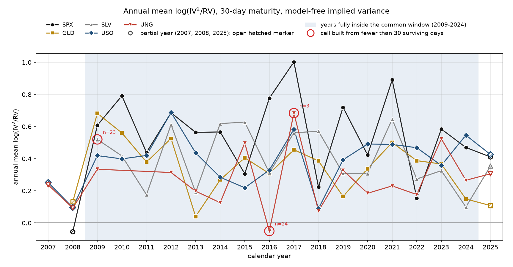
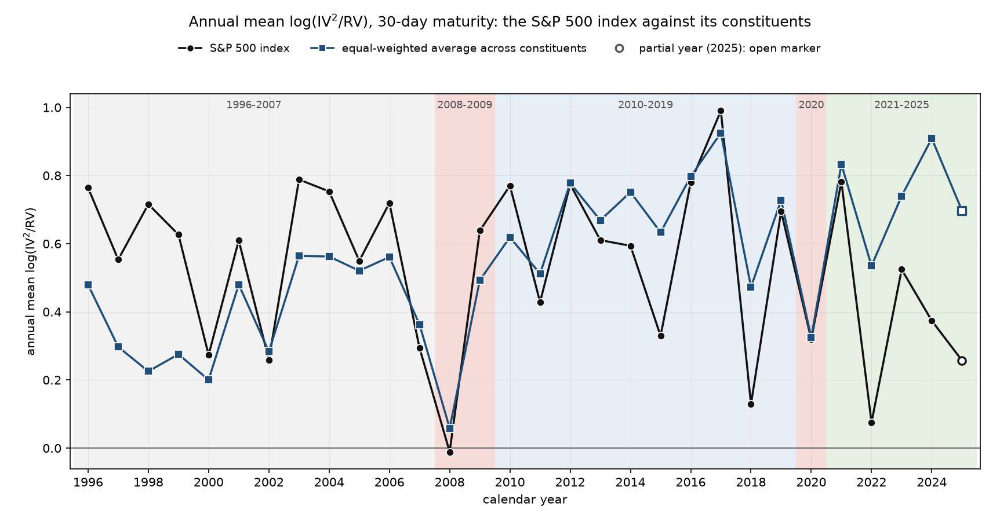

# Commodity variance risk premium and the futures curve

Do options on commodity ETFs price variance the way index options do, and does the premium depend on whether the futures curve is in contango or backwardation?

We studied options on GLD, SLV, USO and UNG from December 2008 to August 2025, with SPX as the equity benchmark. We built implied variance model-free from the full strike ladder on the CBOE VIX method; on SPX, the construction tracks VIX at 0.999 correlation with a median gap of 0.23 vol points. Realized variance is the sum of squared daily log returns over the following 21 or 63 trading days, annualized by 252 over the window length. The curve state for each commodity comes from individual futures settlements, nearest and second-nearest contract by last trading date.

Eighteen tests were registered, eight on the level of the premium and ten on its relation to the curve slope, with Holm correction inside each block. A result counts as supported only when Newey-West and a stationary block bootstrap both clear the corrected level.

## Results

Across the four commodity ETFs, 30-day implied variance ran 23 percent above the variance that followed, on average. The mean log ratio of implied to realized variance is 0.20 with a 95 percent interval of 0.16 to 0.24 on 4,165 trading days, using the at-the-money measure that covers every date. The gap rises to 43 percent on days where all four chains support the model-free construction, and every commodity carries the premium on its own at both maturities. SPX over the same window runs at 77 percent model-free against 43 percent for the commodities, so the commodity premium is a little over half the index premium in percentage terms and about 0.6 of it in log units.

The premium does not depend on the curve. None of the ten slope tests cleared the pre-set bar. The largest effect of a one-standard-deviation move in the curve slope is 0.08 log units. One cell, silver at 30 days, has intervals that exclude zero under both methods and still fails the Holm-corrected level on the bootstrap, which is the case the two-method rule exists to catch. The common factor across the four premia explains about 47 percent of their variance and moves by less than a point after conditioning on slope.

| node | ETF | series | n | mean log ratio | p Newey-West | p bootstrap | verdict |
|---|---|---|---|---|---|---|---|
| 30 | GLD | ATM | 4,170 | 0.1893 | 9.01e-11 | <0.0005 | supported |
| 30 | SLV | model-free | 3,143 | 0.3928 | 6.95e-30 | <0.0005 | supported |
| 30 | USO | ATM | 4,169 | 0.2225 | 3.29e-12 | <0.0005 | supported |
| 30 | UNG | ATM | 4,166 | 0.2097 | 6.76e-17 | <0.0005 | supported |
| 91 | GLD | ATM | 4,128 | 0.1946 | 0.0002 | 0.0005 | supported |
| 91 | SLV | model-free | 3,694 | 0.3509 | 7.31e-13 | <0.0005 | supported |
| 91 | USO | ATM | 4,127 | 0.1582 | 0.0043 | 0.0095 | supported |
| 91 | UNG | ATM | 4,124 | 0.1509 | 0.0004 | 0.0020 | supported |

| node | ETF | slope per 1 sd of z | Newey-West 95 percent interval | p Newey-West | p bootstrap | verdict |
|---|---|---|---|---|---|---|
| 30 | GLD | -0.0256 | [-0.0706, +0.0194] | 0.2651 | 0.2750 | not supported |
| 30 | SLV | -0.0739 | [-0.1241, -0.0237] | 0.0039 | 0.0120 | not robust to inference method |
| 30 | USO | -0.0055 | [-0.0528, +0.0419] | 0.8212 | 0.8370 | not supported |
| 30 | UNG | +0.0373 | [-0.0070, +0.0815] | 0.0989 | 0.0890 | not supported |
| 30 | POOLED | +0.0158 | [-0.0001, +0.0317] | 0.0509 | 0.1900 | not supported |
| 91 | GLD | -0.0576 | [-0.1281, +0.0128] | 0.1090 | 0.1160 | not supported |
| 91 | SLV | -0.0780 | [-0.1427, -0.0134] | 0.0180 | 0.0610 | not supported |
| 91 | USO | +0.0573 | [-0.0066, +0.1212] | 0.0790 | 0.0430 | not supported |
| 91 | UNG | +0.0335 | [-0.0198, +0.0867] | 0.2178 | 0.2260 | not supported |
| 91 | POOLED | +0.0248 | [+0.0021, +0.0475] | 0.0319 | 0.1040 | not supported |

| node | series | share before | share after | change |
|---|---|---|---|---|
| 30 | model-free | 0.4680 | 0.4691 | +0.0011 |
| 30 | ATM | 0.4783 | 0.4761 | -0.0022 |
| 91 | model-free | 0.5241 | 0.5186 | -0.0055 |
| 91 | ATM | 0.5635 | 0.5556 | -0.0079 |

For every commodity ETF except SLV, a registered check found that at one maturity or both the at-the-money premium on the dates the model-free construction drops differs at p below 0.05 from the premium on the dates it retains, so the at-the-money measure, which covers every date, carries their headline; the model-free numbers are larger in every case. Full construction rules, the test family and every judgment call are in items/item1_commodity_vrp/SPEC.md.

**What's not included:** There isn't a trading strategy attached to the study, no cost model or hedging. The premium represents a measurement of how options are priced against what the underlying then does. Five changes made after the data pull and before any test, covering a data filter, the futures source and two registered diagnostics, are logged in section 13 of the spec.

## Reproduce

Reproducing the study requires a WRDS account with OptionMetrics, Datastream futures and CBOE index access, and a ~/.pgpass entry.

    pip install -r requirements.txt
    python -m options_series.item1.run

The run pulls quotes for five underlyings and thirteen futures classes (four primary, nine screened for the gold and silver continuation), builds both implied variance measures, runs the tests and writes every figure and table under items/item1_commodity_vrp/output/.

## References

Carr, P. and Wu, L. (2009). Variance risk premiums. Review of Financial Studies 22(3), 1311–1341.
Jiang, G. and Tian, Y. (2005). The model-free implied volatility and its information content. Review of Financial Studies 18(4), 1305–1342.
Prokopczuk, M., Symeonidis, L. and Wese Simen, C. (2017). Variance risk in commodity markets. Journal of Banking and Finance 81, 136–149.
Ng, V. and Pirrong, S. (1994). Fundamentals and volatility: storage, spreads, and the dynamics of metals prices. Journal of Business 67(2), 203–230.
Politis, D. and Romano, J. (1994). The stationary bootstrap. Journal of the American Statistical Association 89(428), 1303–1313.

# Correlation risk premium: the index against its constituents

Is the variance premium on the S&P 500 index larger than the average variance premium on its constituents, and did the gap change between the post-crisis decade and the post-COVID years?

We studied the S&P 500 and its point-in-time constituents from January 1996 to August 2025, about 500 names a day, linked from CRSP to OptionMetrics by date range. Implied variance at 30 and 91 days is built model-free from the OptionMetrics volatility surface: the 34 delta nodes are interpolated linearly in strike, held flat beyond the 10-delta strikes and integrated on a 1,000-strike grid, following Jiang and Tian (2005). On SPX the construction tracks the strike-ladder measure of the commodity study at 0.994 correlation at 30 days and 0.991 at 91 days, with a median level 3 and 9 percent below it. Realized variance is the sum of squared daily log returns over the following 21 or 63 trading days, annualized by 252 over the window length. The gap is the index log(IV²/RV) minus its equal-weighted average across constituents, on days with at least 300 names carrying a valid surface; implied correlation follows Driessen, Maenhout and Vilkov (2009) with previous-day market-cap weights, on days with at least 450.

Six tests were registered, one per maturity for each of three hypotheses: the index premium exceeds the constituent average, the gap differs between 2021–2025 and 2010–2019, and implied correlation exceeds realized correlation, with Holm correction inside each pair. A result counts as supported only when Newey-West and a stationary block bootstrap both clear the corrected level.

## Results

On the registered measure the index premium exceeds the average constituent premium at 91 days and not at 30 days. The mean gap is 0.22 at 91 days with a 95 percent interval of 0.17 to 0.28 on 7,383 trading days, and −0.004 at 30 days with an interval of −0.043 to 0.034 on 7,425 days. The 30-day result depends on how implied variance is measured: the at-the-money measure gives a gap of 0.07 and value weights give 0.09, both with intervals clear of zero. Single-name surfaces at 30 days carry steep and steepening wings. The median ratio of surface to at-the-money variance for constituents rose from 1.14 in 1996–2007 to 1.57 in 2021–2025, while for SPX it stayed between 1.18 and 1.33, so the surface measure raises the single-name premium by more than the index premium. In 2021–2025 an average of 76 percent of constituents had a higher annual 30-day premium than the index, against 28 percent in 1996–2007.

The gap fell after COVID. At 30 days it fell by 0.25 from 2010–2019 to 2021–2025, from −0.08 to −0.33, and clears both methods; at 91 days the fall of 0.15 does not. Outside the family, value weights give a 30-day fall of 0.17 on the surface measure and 0.10 at the money, both with p below 0.05, while the equal-weighted at-the-money fall of 0.10 has a Newey-West p of 0.07. Implied correlation exceeds realized correlation at both maturities, 0.36 against 0.31 at 30 days and 0.41 against 0.31 at 91 days. In the decomposition the correlation premium adds 0.10 log units to 30-day index variance in 2010–2019 and −0.04 in 2021–2025, and the residual, which holds correlation at its realized level, is negative in every period on the surface measure. The least-squares break in the annual gap falls in 2011 at 30 days and 2001 at 91 days. The share of SPX option volume expiring the same day rose from 1 percent in 2011 to 58 percent in 2025; neither the break nor that overlay carries a test.

| test | node | estimate | Newey-West 95 percent interval | p Newey-West | p bootstrap | verdict |
|---|---|---|---|---|---|---|
| H1 index minus average premium | 30 | -0.0043 | [-0.0429, +0.0343] | 0.5865 | 0.5785 | not supported |
| H1 index minus average premium | 91 | +0.2225 | [+0.1660, +0.2790] | 5.73e-15 | <0.0005 | supported |
| H2 2021–2025 minus 2010–2019 | 30 | -0.2526 | [-0.3624, -0.1429] | 6.39e-06 | <0.0005 | supported |
| H2 2021–2025 minus 2010–2019 | 91 | -0.1457 | [-0.3271, +0.0357] | 0.1155 | 0.1450 | not supported |
| H3 implied minus realized correlation | 30 | +0.0428 | [+0.0311, +0.0545] | 3.57e-13 | <0.0005 | supported |
| H3 implied minus realized correlation | 91 | +0.0976 | [+0.0786, +0.1165] | 3.05e-24 | <0.0005 | supported |

| node | measure | weights | H1 gap | p Newey-West | H2 change | p Newey-West |
|---|---|---|---|---|---|---|
| 30 | surface | equal, registered | -0.0043 | 0.5865 | -0.2526 | 6.39e-06 |
| 30 | surface | value | +0.0914 | 1.15e-07 | -0.1667 | 0.0006 |
| 30 | ATM | equal | +0.0681 | 3.30e-05 | -0.0960 | 0.0725 |
| 30 | ATM | value | +0.1040 | 5.59e-11 | -0.0969 | 0.0427 |
| 91 | surface | equal, registered | +0.2225 | 5.73e-15 | -0.1457 | 0.1155 |
| 91 | surface | value | +0.2467 | 2.58e-20 | -0.0849 | 0.2832 |
| 91 | ATM | equal | +0.1952 | 1.10e-13 | -0.1165 | 0.1675 |
| 91 | ATM | value | +0.2037 | 3.14e-16 | -0.1104 | 0.1355 |

| node | period | mean gap | correlation component | residual |
|---|---|---|---|---|
| 30 | 1996–2007 | 0.1744 | 0.3185 | -0.1441 |
| 30 | 2008–2009 | 0.0378 | 0.1075 | -0.0697 |
| 30 | 2010–2019 | -0.0784 | 0.0963 | -0.1747 |
| 30 | 2020 | -0.0051 | 0.1296 | -0.1347 |
| 30 | 2021–2025 | -0.3310 | -0.0376 | -0.2934 |
| 91 | 1996–2007 | 0.3301 | 0.4031 | -0.0731 |
| 91 | 2008–2009 | 0.0911 | 0.1296 | -0.0385 |
| 91 | 2010–2019 | 0.1953 | 0.2597 | -0.0644 |
| 91 | 2020 | 0.2279 | 0.2680 | -0.0400 |
| 91 | 2021–2025 | 0.0496 | 0.1904 | -0.1408 |

Every H1 and H2 number is also reported at the money and with value weights, and every table in the full results carries the SPX gap between the surface and strike-ladder measures, a median of −0.030 log units at 30 days and −0.095 at 91 days. Full construction rules, the test family and every judgment call are in items/item2_correlation_premium/SPEC.md.

**What's not included:** There is no trading strategy attached to the study, no dispersion trade, cost model or hedging. The gap measures how index and single-name options are priced against what each then realizes.

## Reproduce

Reproducing the study requires a WRDS account with OptionMetrics, CRSP and the CRSP-OptionMetrics link, and a ~/.pgpass entry.

    pip install -r requirements.txt
    python -m options_series.item2.run

The run pulls the S&P 500 membership list, the link table, 30- and 91-day surfaces for every constituent from 1996 to 2025 (about 261 million rows; the run needs about 4 GB of disk), returns, CRSP prices and SPX option volume, builds both implied variance measures, runs the tests and writes every figure and table under items/item2_correlation_premium/output/. The SPX validation reads the strike-ladder series written by python -m options_series.item1.run, which runs first.

## References

Driessen, J., Maenhout, P. and Vilkov, G. (2009). The price of correlation risk: evidence from equity options. Journal of Finance 64(3), 1377–1406.
Carr, P. and Wu, L. (2009). Variance risk premiums. Review of Financial Studies 22(3), 1311–1341.
Jiang, G. and Tian, Y. (2005). The model-free implied volatility and its information content. Review of Financial Studies 18(4), 1305–1342.
Conrad, J., Dittmar, R. and Ghysels, E. (2013). Ex ante skewness and expected stock returns. Journal of Finance 68(1), 85–124.
Bai, J. and Perron, P. (1998). Estimating and testing linear models with multiple structural changes. Econometrica 66(1), 47–78.
Politis, D. and Romano, J. (1994). The stationary bootstrap. Journal of the American Statistical Association 89(428), 1303–1313.
